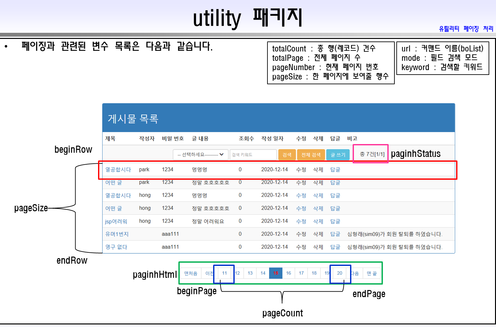

# 주니하랑의 미니 홈쇼핑 제작

### 본 내용은 설진욱(ugcadman@naver.com)강사(님)의 강의를 토대로 작업 중 입니다.
본 내용에 대한 저작권 등에 대한 문의는 위의 강사(님)에게 부탁 드립니다.

2021년 04월 22일 작업  내용

사용자 프로맨 생성
프로맨 접속 아이콘 생성
프로맨 위한 테이블 생성
우편 번호 테이블 생성 및 벌크 로딩
WEB-INF/lib/*.jar 파일 쫀쨰 여부 확인
WEB-INF/todolist.txt 파일 확인
최초 시작 파일 : start.jsp

common.jsp : 모든 문서에서 공통적으로 사용되는 내용을 기록한 파일
twelve : 그리드 시스템의 100%를 의미하는 숫자 (12)
JSTL 태그 라이브러리
loginfo 속성은 로그인 한 사람의 member 객체 정보, session 영역에 바인딩 되어 있다.
whologin은 현재 로그인 상태 저장 변수
whologin은 미로그인(0), 일반 로그인(1), 관리자 로그인(2)로 설정
						- 관리자는 아이디가 'admin'이다.
						
contextpath : 현재 진행중인 프로젝트(컨텍스트)의 이름
mappingName: 요청에 응답하는 uri pattern 이름
YesForm : 폼 태그에서 사용할 공용 변수
NoForm : 폼이 없을 때 사용할 공용 변수

부트 스트랩 관련 파일 링크 

네비게이션 바 만들기

아래 내용은 실제 프로젝트 시 액셀과 같은 걸로 표로 미리 만들어 본 뒤 작업할 것!

-- 계시판 필요 기능 --

									     비회원	      				               일반회원					            관리자

============================================================================================================

계시물 등록                              X                          O                        O
계시물 수정								X								O							 O
계시물 삭제								X								O							 O
계시물 목록 보기							O								O							 O
계시물 상세 보기							X								O							 O
계시물 댓글 달기							X								O							 O

게시물 수정, 삭제, 상세 보기, 답글 작성은 풀다운 메뉴가 아니고, 목록 보기 페이지에서 구현하겠다.

-- 상품 필요 기능 --

													비회원					일반회원					관리자

================================

상품 등록										X								X							 O
상품 수정										X								X							 O
상품 삭제										X								X							 O
상품 목록 보기								X								O							 O
상품 상세 보기								X								O							 O
상품 리뷰										X								O							 O

상품 수정, 삭제, 상세 보기, 리뷰는 풀다운 메뉴가 아니고, 목록 보기 페이지에서 구현하겠다.

### 쇼핑몰 필요 기능

| 내용 | 비회원 | 일반회원 | 관리자 |
| ------ | ------ | ------- | ------ |
| 나의 쇼핑 내역 | X | O | O |
| 장바구니 보기  | X | O | O |

#### Validator 인터페이스 만들기
&nbsp;&nbsp;유효성 검사 수행하기 위한 인터페이스 
&nbsp;&nbsp;유효성 검사가 필요한 일반 컨트롤러 XXXController는 오버라이팅 하여 구현 
&nbsp;&nbsp;유효성 검사에 실패 시 false 값 반환 
&nbsp;&nbsp;public boolean validate(HttpServletRequest request); 
&nbsp;&nbsp;SuperClass가 상속 받는다. 
		
#####유효성 검사 절차

validate 메서드 에서 문제가 있는 파라미터에 접두가 err을 붙혀 request 영역에 바인딩한다. 
양식 태그에 별도  태그를 다음과 같이 작성. 
	${errname} 
공용 파일에 class="err"에 대한 스타일 지정 

#####오류 경고 메시지

어떤 로직에서 발생한 오류나 문제점에 대하여 사용자에게 경고 메시지는 다음과 같이 보여줄 것이다. 
SuperClass에 setErrorMessage(보여줄 메시지) 메서드 사용 
컨트롤러 파일에서 request 영역에 "errmsg"라는 속성에 메시지 저장 
common file에서 해당 오류/경고 메시지를 부트 스트랩의 Alerts 기능으로 출력 

**회원 목록 보기**
**관리자만 가능**

####게시물 목록 보기
#####Command : boList
#####boList.jsp
#####Borad Dao : SelectDataList(int beginRow, int endRow) 

####상품 목록 보기
#####Command : prList
#####prList.jsp 파일은 boList.jsp를 복사하여 생성
#####ProductDao의 SelectDataList(int beginRow, int endRow) 

---

### 2021년 04월 26일

**회원 가입**
**아이디 중복 체크**
**우편 번호 찾기**
**폼 로딩 시 매니져 콤보 박스 자동으로 채우기**
**회원 가입 클릭 시 유효성 검사**
**DB에 추가**

####주요 파라미터
**isCheck :**
&nbsp;	값이 false이면 회원 가입 불가 
&nbsp;	아이디 중복 체크를 통과했을 경우에만 true로 변경 
&nbsp;	사용자가 새로운 아이디 입력(onkeyup Event) 시 false로 변경 
	
**postcodes Table : 우편 번호 관련 Table**

#####우편 번호 Bean Class
shopping.common.model.postcode

#####우편 번호 관련 Dao Class
**CompositeDao Class SelectDataZipcode() Method**
&nbsp;'도로 이름' 또는 '동면읍 이름' 또는 '검색할 단어' 컬럼에서 조건이 맞으면 모두 읽어 온다.

####zipCheck 70 ~ 75 Line :

~~~

<c:set var="address" value="${fn:trim(oneitem.si_nm)} 
&nbsp;${fn:trim(oneitem.sgg_nm)} 
&nbsp;${fn:trim(oneitem.rd_nm)} 
&nbsp;${fn:trim(oneitem.bd_ma_sn)} 
&nbsp;(${fn:trim(oneitem.emd_nm)} 
&nbsp;${fn:trim(oneitem.search_word)})" />

~~~

fn은 function의 약자이고, trim은 공백을 없애기 위해 사용하는 메서드이다.

**AREA_CD 우편번호**
**SI_NM 시도 (서울특별시, 경기도 등)**
**SGG_NM 시구군(군산시, 창원시 합포구 등)**
**BC_MA_SN 번지**
**RD_NM 도로 이름**
**EMD_NM 동면읍**
**SEARCH_WORD 검색할 단어**

#####폼 로딩 시 매니저 콤보 박스 자동 채우기
MemberInsertController의 doGet()에 작업

#####MemberDao Class의 GetManagerList() 만들기
meInsertForm.jsp에서 콤보 박스 채워 넣기

---

### 2021년 04월 27일 작업 내용

**1. 게시물 목록 보기** 
**2. 페이지 당 10개씩 목록 출력되게 만들기** 
**3. 페이징 처리 가능하게 만들기** 
**4. 필드 검색이 가능하게 만들기** 

##### 게시판 관련 사용 변수
---
 

totalCount: 총 행(레코드) 건수 
totalPage: 전체 페이지 수 
pageNumber: 현재 페이지 번호 
pageSize: 한 페이지에 보여줄 행(레코드) 수 
url: Command 이름(boList)입력 
beginRow: 게시판 맨 위에 오는 행(내용) 
endRow: 게시판 맨 밑에 오는 행(내용) 
pageCount: 게시판 목록을 넘기기 위해 사용 
beginPage: 게시판 목록을 넘기기 위해 사용하는 것 중 맨 앞 
endPage: 게시판 목록을 넘기기 위해 사용하는 것 중 맨 뒤 
pagingHtml: 게시판 목록 넘기기 위해 사용하는 버튼(?) 
pagingStatus: 검색 결과 건수 표현 
&nbsp;&nbsp;&nbsp; - "총" + totalCount + "건[" + pageNumber + "/" + totalPage + "]"  
mode: 필드 검색 관련 
keyword: 검색할 Keyword  
---

### 관련 Command : boList

### 관련 Dao : BoardDao

	- SelectDataList(int beginRow, int endRow, String mode, String keyword)
	  	beginRow: 해당 페이지의 시작 랭킹 숫자
		endRow: 해당 페이지의 끝 랭킹 숫자
		mode: 필드 검색 컬럼(Table에 실제 존재하는 컬럼 이름으로 정해야 한다.)
		keyword: 검색 키워드
		
### 관련 Controller : BoardListController

### 관련 JSP : boList.jsp
		
### 게시물 데이터 30개 추가를 위해 topN 구문 만들기
#### paging.java Class 구현하기
	- Paging Class는 페이징 처리를 도와주는 Utility Class입니다.

### 게시판 Table에 대한 pl-sql For문
#### (연습을 위해 게시판에 30개의 동일한 게시물을 올리기 위해 pl-spl문 사용)
~~~ 
begin
	for i in 1..30 loop
	insert into boards 
	values(myboard.nextval, '열공합시다', 'kang', '1234', '멍멍멍', default, default,  
	default, default, default, default);
end loop;

end;
/

commit;
~~~

### topN 구문
#### 게시판 페이징 처리를 위해 실습 하겠습니다.
~~~
select ranking, no, subject, writer, password, content, readhit, regdate, groupno, orderno, depth, remark
from ( select ranking, no, subject, writer, password, content, readhit, regdate, groupno, orderno, depth, remark, rank() over (order by no desc) as ranking from boards )
where ranking between 1 and 10;
~~~

## paging Class 작성
shopping.utility 패키지에서 작성

기존 Paging Class Backup 이 후 작업

pageTest.java: Paging Test를 위한 Java Class
paging.java: Paging Class

### * 오늘의 참고 사항 * 
---
게시판 검색 버튼에서 검색을 누르면 원하는 페이지로 이동을 못해 원하는 결과를 못 받는 경우가 발생하였습니다.

원래 **boList.jsp 70번째 줄** 검색 버튼에 **type이 submit**으로 되어 있었는데, **button**으로 변경을 하니 정상적으로 구동 되는 것을 확인 하였습니다.

### 필드 검색 기능
**자바 스크립트 함수 코딩**

## 2021년 04월 28일 작업 내용 

**5. 하이퍼 링크 이용 수정, 삭제 답글 페이지 이동 가능하게 만들기**   

#####BoardListController
&nbsp;**변수 url 수정**

#####boList.jsp
&nbsp;**필드 검색 상태 값의 보전 기능 추가**   

###게시물 목록 보기 페이지

####게시물 제목 :클릭 시 상세 보기 페이지 이동

&nbsp;**수정, 삭제, 답글 링크 만들고, 기능 구현**   

**일반적으로 넘겨 주어야 할 파라미터 목록** 

---

&nbsp;&nbsp;- 기본키 (primary key) 
&nbsp;&nbsp;- 페이지 번호(pageNumber)와 필드 검색 모드(mode)와 키워드(keyword)   

#####Shopping.utility.FlowParameters Class 
**다음 변수들을 Member로 가지고 있는 파라미터 처리 유틸리티 Class** 

&nbsp;&nbsp;- 페이지 번호(pageNumber) 
&nbsp;&nbsp;- 필드 검색 모드(mode) 
&nbsp;&nbsp;- 키워드(Keyword)   

### * 오늘의 참고 사항 * 

**게시판의 'primary Key'는 글 번호**

#### 게시물 등록 하기 

글 번호는 시퀀스 번호를 이용하여 자동 입력 되게 만들겠습니다. 
작성자의 정보는 세션에 들어있는 정보를 사용하게 만들겠습니다. 
조회수와 작성 일자 및 비고 컬럼은 DB의 기본값을 사용하겠습니다. 
직접 입력할 정보는 글 제목, 글 내용, 작성자가 설정하는 비밀번호로 하겠습니다. 
유효성 검사를 충족하게 만들겠습니다.   

#### 게시물 수정 하기 

자신이 작성한 글만 수정이 가능하게 만들겠습니다. 
이전에 작성한 데이터 목록을 보이게 만들겠습니다. 
글 번호(no), 작성자(writer), 조회수(readhit)은 수정이 불가능 하게 만들겠습니다. 
수정된 이후 원래 페이지 번호로 돌아가게 만들겠습니다. 
유효성 검사를 통과하게 만들어야 합니다.   

#### 게시물 상세 보기 

---

해당 게시글에 대한 상세 보기(읽기 전용)가 되도록 만들겠습니다. 
[이전]으로 돌아갈 때, 다른 사람의 게시물일 경우 조회수를 +1 하고, 원래 페이지(pageNumber)로 돌아가게 만들겠습니다.   

#### 게시물 답글 쓰기 

게시물 답글이 잘 되도록 만드려고 합니다. 
유효성 검사 조건을 통과하게 하고 싶습니다. 
페이징 처리가 잘 되도록 만드려고 합니다. 
원 글 하단에 답글이 배치 되도록 만들겠습니다.
 
글의 깊이(depth 컬럼)는 3개 까지만 허용 하겠습니다. 
&nbsp; depth=3인 행을 추가해보고, '답글' 링크가 보이지 않는지 점검 해 봅니다. 
원 글 1개에 대한 최대 답글(댓글)은 5개를 초과하지 못하도록 하겠습니다. 
Controller에서 Dao를 통하여 해당 groupno와 동일한 값을 가지는 행의 수를 확인하도록 만들겠습니다. 
&nbsp;조건에 위배가 되면, Alert 메시지를 출력하고, 더 이상 진행 되지 않게 만들 것 이에요.
&nbsp;답글(댓글) 앞에는 re 뱃지를 붙히도록 하겠습니다. 

---

#### 상품 목록 보기 

페이징 처리가 되도록 만들겠습니다. 
필드 검색이 되도록 만들겠습니다.   

## 2021년 04월 29일 작업 내용 
##게시물 답글 달기 

---

1.boards Table의 groupno 갱신 

~~~
update boards set groupno = no;
commit;
~~~
   

2.BoardDao.SelectDataList() topN 구문 over()의 order by 구문 수정 

~~~
order by groupno desc, orderno asc, depth asc
~~~
   

3.답글(댓글) 관련 파마미터 
boList.jsp에서 답글 관련 파라미터들을 문자열로 결합 작업 

### * 오늘의 참고 사항 * 

현재 문제 사항 : 댓글을 달고 나서 페이지 새로고침 시 동일한 게시물이 올라가는 문제 

##파일 업로드 
**상품 등록하기(prInsertForm.jsp)
WebContent\WEB-INF\lib\cos.jar 파일이 존재해야 합니다.  

상품 등록은 관리자만 할 수 있게 만들겠습니다. 
이미지 업로드 경로에 파일 업로드가 가능하게 만들 것 이에요. 
테이블에 1건의 데이터 정보가 삽입 되게 만들 것 이에요. 
유효성 검사를 진행 할 것 입니다.  

--주의 사항-- 
상품 번호는 시퀀스를 사용하여 자동으로 입력 되게 만들 것 이에요. 

## 2021년 04월 30일 작업 내용 
**게시물 상세보기**

#### 쇼핑몰 관련
shopping.common.model.MyCartList 
&nbsp;&nbsp;사이트 안에 카트 개념을 위한 Utility Class 입니다. 

shopping.common.model.ShoppingInfo 
&nbsp;&nbsp;고객이 주문한 상품 1개에 대한 정보를 담고 있는 Class. 

##### 관련 변수  
loginfo: session에 들어 있는 login 한 사람의 정보를 담고 있는 변수  

shoplists: session에 들어 있는 쇼핑 내역을 담고 있는 List 컬렉션(shoppingInfo)가 들어있는 변수  

mycart:session에 들어 있는 회원의 장바구니 이름이 들어 있는 변수   

### * 오늘의 참고 사항 * 
 

현재 문제 사항 : 상품 상세 보기에서 사진이 나오지 않는 문제 